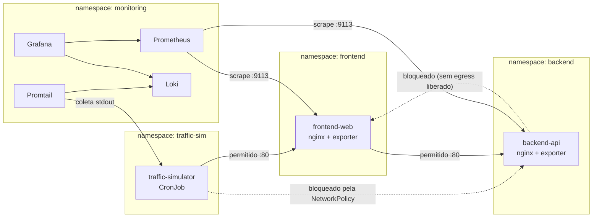

# k8s-network-monitor

Laboratório de observabilidade e segurança de rede em Kubernetes: isolamento
de tráfego entre namespaces via `NetworkPolicy`, coleta de métricas com
Prometheus, logs estruturados com Loki/Promtail, visualização no Grafana, e
um simulador que gera tráfego permitido e tráfego propositalmente bloqueado
para provar que as políticas realmente funcionam.

## Motivação

Este projeto une práticas de segurança da informação a conceitos de controle
de acesso e gestão de risco que desenvolvi durante minha experiência no
mercado financeiro, aplicados a um ambiente de DevOps sobre Kubernetes.

A maioria dos labs de Kubernetes por aí mostra como subir uma aplicação.
Este mostra como **restringir** o que ela pode acessar — e como comprovar
isso com dados, não só com a leitura do YAML. A pergunta que o projeto tenta
responder é: "se o frontend for comprometido, ele consegue falar com
qualquer coisa no cluster, ou só com o que precisa?"

## Arquitetura



Cada namespace começa com **deny-all** (ingress e egress) e recebe apenas as
liberações explícitas necessárias — postura zero-trust. As setas
pontilhadas no diagrama são bloqueios intencionais, usados como teste
negativo.

## Stack

| Camada | Ferramenta |
|---|---|
| Orquestração | Kubernetes (kind, 1 control-plane + 2 workers) |
| Isolamento de rede | `NetworkPolicy` nativa |
| Métricas | Prometheus + nginx-prometheus-exporter |
| Logs | Loki + Promtail |
| Dashboards | Grafana |
| Geração de tráfego | Script Python (CronJob) |

## Pré-requisitos

- Docker
- [kind](https://kind.sigs.k8s.io/)
- kubectl
- helm

## Como rodar

```bash
git clone https://github.com/FelipeLukas/k8s-network-monitor.git
cd k8s-network-monitor
chmod +x scripts/*.sh
./scripts/setup.sh
```

O script cria o cluster, aplica os manifests na ordem correta e sobe
Prometheus, Loki/Promtail e Grafana via Helm.

Acessar o Grafana:

```bash
kubectl port-forward -n monitoring svc/grafana 3000:80
# usuário: admin
# senha:   kubectl get secret -n monitoring grafana -o jsonpath="{.data.admin-password}" | base64 -d
```

## Provando que o isolamento funciona

```bash
./scripts/validate-network-policies.sh
```

O script sobe pods descartáveis em cada namespace e testa conectividade
real. Saída esperada:

```
[frontend] frontend -> backend (deve ser permitido) ... OK (ALLOWED)
[traffic-sim] traffic-sim -> frontend (deve ser permitido) ... OK (ALLOWED)
[traffic-sim] traffic-sim -> backend (deve ser bloqueado) ... OK (BLOCKED)
[backend] backend -> frontend (deve ser bloqueado, egress não liberado) ... OK (BLOCKED)
```

## Estrutura do repositório

```
manifests/
  00-namespaces/       namespaces com labels usadas pelos seletores das policies
  10-network-policies/ deny-all + liberações explícitas, em ordem de leitura
  20-apps/              frontend, backend e o simulador de tráfego
  30-monitoring/        values do Helm para Prometheus, Loki/Promtail e Grafana
scripts/
  setup.sh                       sobe o cluster e toda a stack
  traffic_simulator.py           gera tráfego normal, em rajada e bloqueado
  validate-network-policies.sh   evidência de que as policies funcionam
```

## Decisões de projeto

- **Single-cluster com isolamento por namespace**, em vez de dois clusters
  separados: reduz custo operacional do lab e já demonstra o conceito de
  isolamento de forma clara — dual-cluster fica como evolução futura caso
  eu queira mostrar isolamento em nível de infraestrutura, não só de
  política.
- **Promtail** para envio de logs ao Loki, em vez de um script Bash
  customizado: é a solução padrão do ecossistema e o que se espera
  encontrar em ambiente produtivo real.

## Próximos passos

- [ ] Dashboard Grafana provisionado automaticamente (requests/s, taxa de
      bloqueio por policy, latência)
- [ ] Alertas no Prometheus para picos de tráfego bloqueado
- [ ] Variante com Cilium + Hubble para visualização de fluxo em tempo real
- [ ] Setup dual-cluster como comparação

## Licença

MIT — veja [LICENSE](LICENSE).